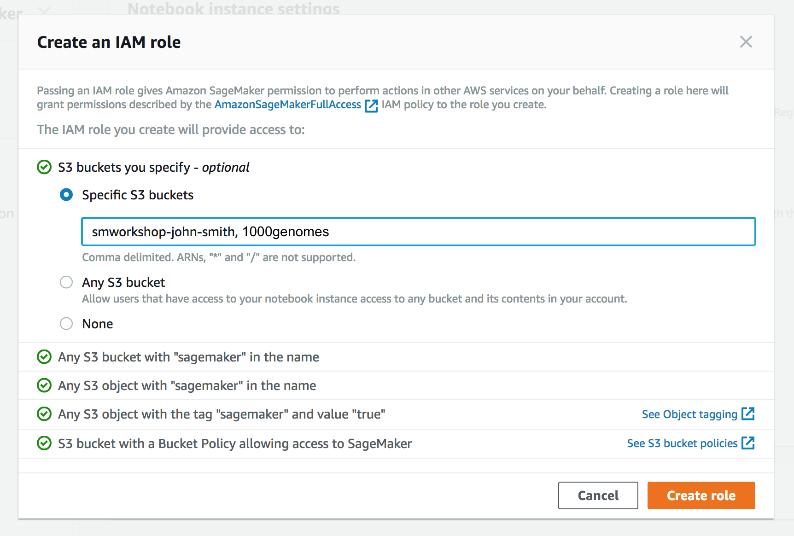

# Introduction to SageMaker for Researchers

Amazon SageMaker is a fully managed service that enables developers and data scientists to quickly and easily build, train, and deploy machine learning models at any scale. This repository contains a collection of hands on content that will introduce and guide you through using SageMaker for your research.


During this workshop, you'll explore various data sets, create model training jobs using SageMaker's hosted training feature, and create endpoints to serve predictions from your models using SageMaker's hosted endpoint feature.  

**BEFORE attempting this workshop, please review the Prerequisites below and complete any actions that are required.**

## Prerequisites

### AWS Account

In order to complete this workshop you'll need an AWS Account, and an AWS IAM user in that account with at least full permissions to the following AWS services: 

- AWS IAM
- Amazon S3
- Amazon SageMaker

**Use Your Own Account**: The code and instructions in this workshop assume only one student is using a given AWS account at a time. If you try sharing an account with another student, you'll run into naming conflicts for certain resources. You can work around these by appending a unique suffix to the resources that fail to create due to conflicts, but the instructions do not provide details on the changes required to make this work. Use a personal account or create a new AWS account for this workshop rather than using an organization’s account to ensure you have full access to the necessary services and to ensure you do not leave behind any resources from the workshop.

**Costs**: Some, but NOT all, of the resources you will launch as part of this workshop are eligible for the AWS free tier if your account is less than 12 months old. See the [AWS Free Tier page](https://aws.amazon.com/free/) for more details. An example of a resource that is **not** covered by the free tier is the ml.m4.xlarge notebook instance used in some workshops. To avoid charges for endpoints and other resources you might not need after you've finished a workshop, please refer to the [**Cleanup Guide**](./CleanupGuide). 


### AWS Region

SageMaker is not available in all AWS Regions at this time.  Accordingly, we recommend running this workshop in one of the following supported AWS Regions:  N. Virginia, Oregon, Ohio, or Ireland.

Once you've chosen a region, you should create all of the resources for this workshop there, including a new Amazon S3 bucket and a new SageMaker notebook instance. Make sure you select your region from the dropdown in the upper right corner of the AWS Console before getting started.


### Browser

We recommend you use the latest version of Chrome or Firefox to complete this workshop.

## Modules

This workshop is divided into the following modules. It is recommended that you complete them in the order listed.

- [Preliminaries](#preliminaries)

- [Creating a Notebook Instance](#creating-a-notebook-Instance)

- [Labs](#labs)

  1. [Digit Classification with Linear Learner](./Labs/01-digit-classification-linear-learner.md)
  2. [Distributed Training with TensorFlow](./Labs/02-distributed-training-tensorflow.md)
  3. [Bringing Your Own Model](./Labs/03-bring-your-own-model.md)
  4. [Using Public Datasets](./Labs/04-using-public-datasets.md)

## Preliminaries

Be sure you have completed all of the prerequisites above.


### Amazon Web Services:  A Brief Overview

If you are new to Amazon Web Services (AWS), read this section. 

Amazon Web Services (AWS) is a secure cloud services platform, offering compute power, database storage, content delivery and other functionality.

#### What is Cloud Computing?

Before cloud computing, if you wanted compute, storage, and other IT services, you first needed to buy physical servers, network equipment, racks, cabling, etc.  Then in a secure, climate controlled room (something you had to organize yourself), you would setup the equipment you purchased: unpack, install, connect, configure, assign, manage, and monitor.  You paid the bills to power all of this infrastructure -- and -- every few years you had to replace your servers and infrastructure (assuming they lasted a few years), along with occasionally purchasing additional serviers to meet projected increases in demand.

In the cloud computing model you are not buying physical assets.  Instead, you purchase time and access to infrastructure that is setup and maintained by a Cloud Service Provider - e.g. Amazon Web Services (AWS).  In this model, computing infrastructure can be treated as a utility, much like municipal electricity.  Think of how you use electricity in your home.  You have access to it via plugs in the wall and pay a monthly bill for the amount that you use to run your lights, appliances, etc.  You don't need to worry about the engineering details of how to generate electricity and transmit it from the power station to your home.  With cloud computing, you don't need to worry about maintaining the computing infrastructure hardware.  You only need to choose what type and quantity of infrastructure you need, and for how long you need to use it for.

#### Core Services

At the time of this writing, AWS offers over 100 distinct services that you can use to build architecture that best suits your needs.  Nearly all of these services are built on top of foundational "core" services:

- Compute - Amazon Elastic Compute Cloud (EC2).  This service provides servers of varying types (CPU, GPU, FPGA, etc) and capabilities.
- Storage - Amazon Elastic Block Store (EBS) and Amazon Simple Storage Service (S3).  These services provide block level storage for EC2 servers and generic object storage.
- Networking - Amazon Virtual Private Cloud (VPC).  This service handles network security and routing between your EC2 servers.

Access to all AWS services is managed via AWS Identity and Access Management (IAM) which allows fine grain control over users within an AWS account, what services they can access, and how such services can be used.

There are many ways to configure, launch, and monitor the services you use in AWS.  The easiest interface is the AWS Console, which is where you will land after you first login to your AWS account.  For more advanced use, there is also the AWS Command Line Interface (CLI) and SDK frameworks for popular programming languages like Java and Python.

#### Security

Cloud security at AWS is the highest priority. Helping to protect the confidentiality, integrity, and availability of our customers’ systems and data is of the utmost importance to AWS, as is maintaining customer trust and confidence.

All AWS users benefit from data center architecture and network architecture built to satisfy the requirements of the most security-sensitive organizations. AWS and its partners offer hundreds of tools and features to help you meet your security objectives for visibility, auditability, controllability, and agility. This means that you can have the security you need, but without the capital outlay and with much lower operational overhead than in an on-premises environment.

Security is, nonetheless, a shared responsibility. AWS takes responsibility for securing the underlying infrastructure that supports the cloud, and you’re responsible for anything you put in the cloud or connect to the cloud. This shared responsibility model can reduce your operational burden in many ways, and it may even improve your default security posture without additional action on your part.


### Jupyter Notebooks:  A Brief Overview

If you are new to using Jupyter notebooks, read this section.

Jupyter is an open-source web application that allows you to create and share documents that contain live code, equations, visualizations and narrative text. Uses include: data cleaning and transformation, numerical simulation, statistical modeling, data visualization, machine learning, and much more. With respect to code, it can be thought of as a web-based IDE that executes code on the server it is running on instead of locally. 

There are two main types of "cells" in a notebook:  code cells, and "markdown" cells with explanatory text. You will be running the code cells.  These are distinguished by having "In" next to them in the left margin next to the cell, and a greyish background.  Markdown cells lack "In" and have a white background. In the screenshot below, the upper cell is a markdown cell, while the lower cell is a code cell:


To run a code cell, simply click in it, then either click the **Run Cell** button in the notebook's toolbar, or use Control+Enter from your computer's keyboard. It may take a few seconds to a few minutes for a code cell to run. You can determine whether a cell is running by examining the `In[]:` indicator in the left margin next to each cell:  a cell will show `In [*]:` when running, and `In [a number]:` when complete.

Please run each code cell in order, and **only once**, to avoid repeated operations.  For example, running the same training job cell twice might create two training jobs, possibly exceeding your service limits.


## Creating a Notebook Instance

SageMaker provides hosted Jupyter notebooks that require no setup, so you can begin processing your training data sets immediately. With a few clicks in the SageMaker console, you can create a fully managed notebook instance, pre-loaded with useful libraries for machine learning. You need only add your data.

We'll start by creating an Amazon S3 bucket that will be used throughout the workshop.  We'll then create a SageMaker notebook instance, which we will use for the other workshop modules.

### 1. Create a S3 Bucket

SageMaker typically uses S3 as storage for data and model artifacts.  In this step you'll create a S3 bucket for this purpose. To begin, sign into the AWS Management Console, https://console.aws.amazon.com/.

#### High-Level Instructions

Use the console or AWS CLI to create an Amazon S3 bucket. Keep in mind that your bucket's name must be globally unique across all regions and customers. We recommend using a name like `smworkshop-firstname-lastname`. If you get an error that your bucket name already exists, try adding additional numbers or characters until you find an unused name.

<details>
<summary><strong>Step-by-step instructions (expand for details)</strong></summary><p>

1. In the AWS Management Console, choose **Services** then select **S3** under Storage.

1. Choose **+Create Bucket**

1. Provide a globally unique name for your bucket such as `smworkshop-firstname-lastname`.

1. Select the Region you've chosen to use for this workshop from the dropdown.

1. Choose **Create** in the lower left of the dialog without selecting a bucket to copy settings from.

</p></details>

### 2. Launching the Notebook Instance

1. In the upper-right corner of the AWS Management Console, confirm you are in the desired AWS region. Select N. Virginia, Oregon, Ohio, or Ireland.

2. Click on Amazon SageMaker from the list of all services.  This will bring you to the Amazon SageMaker console homepage.


3. To create a new notebook instance, go to **Notebook instances**, and click the **Create notebook instance** button at the top of the browser window.


4. Type smworkshop-[First Name]-[Last Name] into the **Notebook instance name** text box, and select ml.m4.xlarge for the **Notebook instance type**.


5. For IAM role, choose **Create a new role**, and in the resulting pop-up modal, select **Specific S3 buckets** under **S3 Buckets you specify – optional**. In the text field, paste the name of the S3 bucket you created above, AND the following bucket names separated from the first by a comma: `1000genomes`. The combined field entry should look similar to ```smworkshop-john-smith, 1000genomes```. Click **Create role**.



6. You will be taken back to the Create Notebook instance page.  Click **Create notebook instance**.

#### 3. Accessing the Notebook Instance

1. Wait for the server status to change to **InService**. This will take several minutes, possibly up to ten but likely less.


2. Click **Open**. You will now see the Jupyter homepage for your notebook instance.


## Labs

The labs for this workshop have been chosen to highlight capabilities of Amazon SageMaker that are most relevant to scientific research.  They are intended to guide students from out-of-the-box capabilities, to using custom frameworks and code, and utilizing large external datasets.

1. [Digit Classification with Linear Learner](./Labs/01-digit-classification-linear-learner.md)

    In this lab we will introduce you to Amazon Sagemaker using the Amaazon-provided Linear Learner algorithm to perform binary classification of images of handwritten digits from the [MNIST Database](http://yann.lecun.com/exdb/mnist/). Specifically, we'll train a model to identify whether or not a digit is a "0". In doing so, we will demonstrate how to use a Jupyter notebook and the [SageMaker Python SDK](https://github.com/aws/sagemaker-python-sdk) to create a script to pre-process data, train a model, create a SageMaker hosted endpoint, and make predictions against this endpoint - completing a full machine learning workflow end-to-end.

2. [Distributed Training with TensorFlow](./Labs/02-distributed-training-tensorflow.md)

    In this lab we will be using images of handwritten digits from the [MNIST Database](http://yann.lecun.com/exdb/mnist/) to demonstrate how to perform distributed training using SageMaker. Using a convolutional neural network model based on the [TensorFlow MNIST Example](https://github.com/tensorflow/models/tree/master/official/mnist), we will demonstrate how to use a Jupyter notebook and the [SageMaker Python SDK](https://github.com/aws/sagemaker-python-sdk) to create your own script to pre-process data, train a model, create a SageMaker hosted endpoint, and make predictions against this endpoint. The model will predict what the handwritten digit is in the image presented for prediction. Besides demonstrating a "bring your own script" for TensorFlow use case, the example also showcases how easy it is to set up a cluster of multiple instances for model training in SageMaker.

3. [Bringing Your Own Model](./Labs/03-bring-your-own-model.md)

    A crucial aspect to scientific research is  building new tools / methods along the way to making new discoveries.  For machine learning problems the code that implements a specialized algorithm could be quite complex, or special framework additions are needed.  Amazon SageMaker provides the flexibility to bring your own algorithms and models and train and host them in the same way as built-in algorithms.  In this lab, we'll explore how to integrate a decision tree algorithm written using the [https://scikit-learn.org](scikit-learn) machine learning package for Python into SageMaker.

4. [Using Public Datasets](./Labs/04-using-public-datasets.md)

    Machine learning is a data driven process.  Sharing key datasets publicly allows smart minds around the world to perform novel analyses and generate new insights.  In this lab, we will use the [1000 Genomes Project](https://aws.amazon.com/1000genomes/) dataset - a collection of DNA sequence variations from over 1000 individuals.  We will apply unsupervised learning via the Amazon-provided K-Means algorithm to group the geographic location of sequences based on their variant information.


## Cleanup

To avoid charges for resources you no longer need when you're done with this workshop, you can delete them or, in the case of your notebook instance, stop them.  Here are the resources you should consider:

- **Endpoints**:  these are the clusters of one or more instances serving inferences from your models. If you did not delete them from within a notebook, you can delete them via the SageMaker console.  To do so:

  - Click the **Endpoints** link in the left panel.  
  
  - Then, for each endpoint, click the radio button next to it, then select **Delete** from the **Actions** drop down menu. 
  
  - You can follow a similar procedure to delete the related Models and Endpoint configurations.


- **Notebook instance**:  you have two options if you do not want to keep the notebook instance running. If you would like to save it for later, you can stop rather than deleting it. 

  - To **stop** a notebook instance:  click the **Notebook instances** link in the left pane of the SageMaker console home page. Next, click the **Stop** link under the 'Actions' column to the left of your notebook instance's name.  After the notebook instance is stopped, you can start it again by clicking the **Start** link.  Keep in mind that if you stop rather than delete it, you will be charged for the storage associated with it.  

  - To **delete** a notebook instance:  first stop it per the instruction above. Next, click the radio button next to your notebook instance, then select **Delete** from the **Actions** drop down menu. 

- **S3 Bucket**:  if you retain the S3 bucket created for this workshop, you will be charged for storage.  To avoid these charges if you no longer wish to use the bucket, you may delete it. To delete the bucket, go to the S3 service console, and locate your bucket's name in the bucket table. Next, click in the bucket table row for your bucket to highlight the table row. At the top of the table, the **Delete Bucket** button should now be enabled, so click it and then click the **Confirm** button in the resulting pop-up to complete the deletion.  


## License

The contents of this workshop are licensed under the [Apache 2.0 License](./LICENSE).
